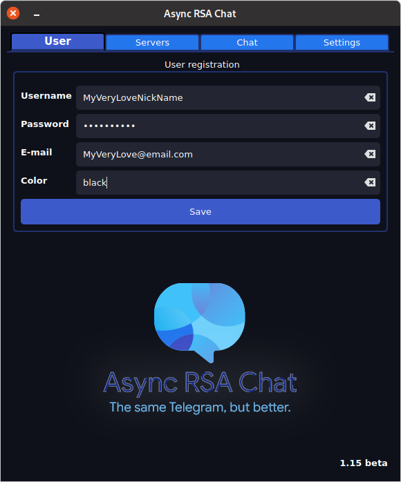
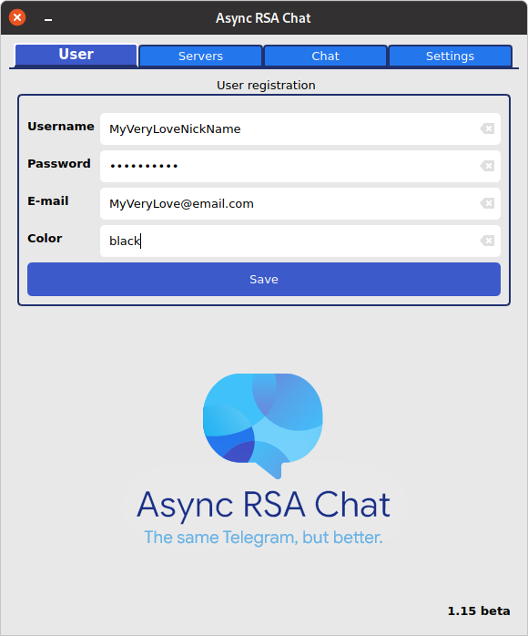
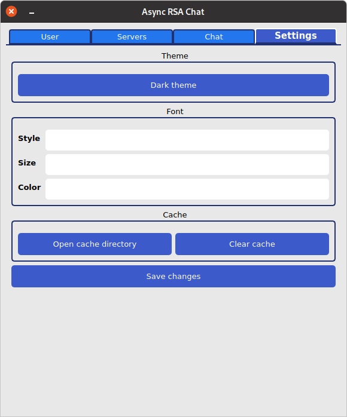

# Классный чатик, почти телеграм, но без капустки и не красный.

## Подготовочка

`pip install -r requirements.txt` или

`python3 -m pip install -r requirements.txt` если не вышло с первым

## Запускам сервер

Сначала найти, понять и установить, PostgreSQL

Потом немного шаманства, которое должно было бы быть в .env для параметризации и

`python3 ./server.py`

## Запускаем Клиент

тут всё просто `python3 ./new_client.py` пам-пам
